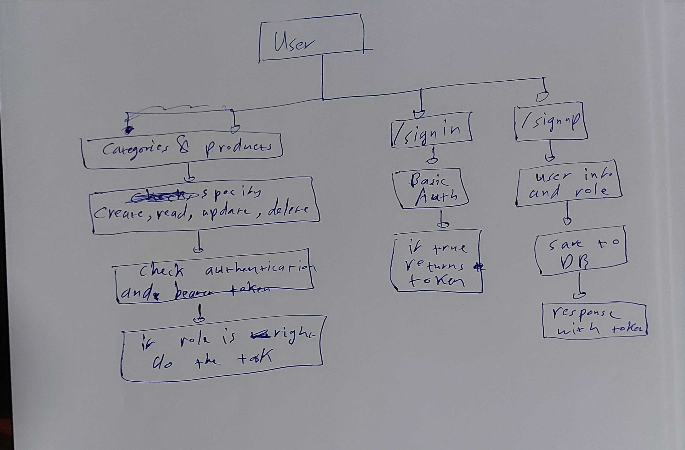

# LAB - 15

## Authenticated API Server

### Author: Ammar Badwan

### Links and Resources

- [Swagger](https://app.swaggerhub.com/apis/ammarbadwan/Api-Server-ammar/1)
- [Pull Request](https://github.com/ammarBadwan-401-advanced-javascript/authenticated-api-server/pull/1)
- [GitHub Actions CI](https://github.com/ammarBadwan-401-advanced-javascript/authenticated-api-server/actions)

### Modules

* `./lib/server.js`
* `./lib/models/model.js`
* `./lib/models/categories/categories.collection.js`
* `./lib/models/products/products.collection.js`
* `./routes/api.js`
* `./middleware/getModel.js`
* `./middleware/404.js`
* `./middleware/500.js`
* `./middleware/logger.js`
* `./middleware/timestamp.js`
* `./auth/models/user-schema.js`
* `./auth/middleware/authorize.js`
* `./auth/middleware/basic.js`
* `./auth/middleware/bearer-auth.js`
* `./auth/middleware/oauth.js`

### How to initialize the application

* `node index.js` --> To start the server using express

### First you need to signup an account using 
* For **POST**: `https://ammar-lab15.herokuapp.com/signup` to sign a new account , `https://ammar-lab15.herokuapp.com/signin`, to sign into an account and get bearer token.
* For **GET**: `https://ammar-lab15.herokuapp.com/users` loads all users.
* `https://ammar-lab15.herokuapp.com/` use login by auth with github.

### For the routes, you need a bearer token with the right previleges:

* For **GET**: `https://ammar-lab15.herokuapp.com/products`, `https://ammar-lab15.herokuapp.com/products/:id` , `https://ammar-lab15.herokuapp.com/categories`, `https://ammar-lab15.herokuapp.com/categories/:id`, just need any account to see.
* For **POST**: `https://ammar-lab15.herokuapp.com/products` , `https://ammar-lab15.herokuapp.com/categories`, needs a user with create ability.
* For **PUT**:  `https://ammar-lab15.herokuapp.com/products/:id` , `https://ammar-lab15.herokuapp.com/categories/:id`, needs a user with update ability.
* For **DELETE**:  `https://ammar-lab15.herokuapp.com/products/:id` ,`https://ammar-lab15.herokuapp.com/categories/:id`, needs a user with delete ability.

### Tests

* Lint test: `npm run lint`.
* Unit test: `npm test`.

### UML 

