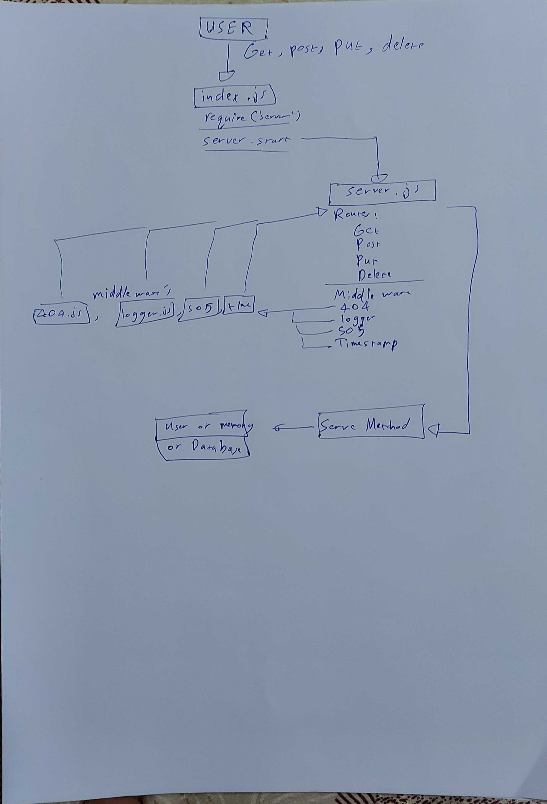

# LAB - 09

## API-Server

### Author: Ammar Badwan

### Links and Resources

- [Swagger](https://app.swaggerhub.com/apis/ammarbadwan/Api-Server-ammar/1)
- [Pull Request](https://github.com/ammarBadwan-401-advanced-javascript/api-server/pull/5)
- [GitHub Actions CI](https://github.com/ammarBadwan-401-advanced-javascript/api-server/actions)

### Modules

* `./lib/server.js`
* `./lib/models/model.js`
* `./lib/models/categories/categories.collection.js`
* `./lib/models/products/products.collection.js`
* `./routes/api.js`
* `./middleware/getModel.js`
* `./middleware/404.js`
* `./middleware/500.js`
* `./middleware/logger.js`
* `./middleware/timestamp.js`

### How to initialize the application

* `json-server --watch ./data/db.json` --> To start the server with that database file using json-server
* `node index.js` --> To start the server using express

* For the routes:
* For **GET**: `localhost:PORT/products`, `localhost:PORT/products/:id` , `localhost:PORT/categories`, `localhost:PORT/categories/:id`.
* For **POST**: `localhost:PORT/products` , `localhost:PORT/categories`.
* For **PUT**:  `localhost:PORT/products/:id` , `localhost:PORT/categories/:id`
* For **DELETE**:  `localhost:PORT/products/:id` ,`localhost:PORT/categories/:id`

### Tests

* Lint test: `npm run lint`.
* Unit test: `npm test`.

### UML 
